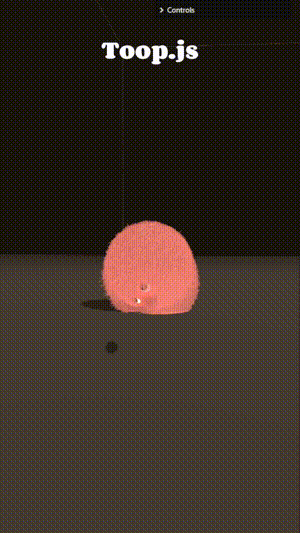

# Toop

**Toop** means *ball* in Farsi. It is a real-time interactive fur simulation — a furry sphere with eyes, personality, and physics. Drag it, throw it, watch it react.

---

---

## Project Structure

This repository contains two implementations of the same simulation:

| Directory | Description |
|-----------|-------------|
| [`Toop_js/`](./Toop_js/README.md) | JavaScript version — runs in the browser using Three.js and GPGPU. Live demo available. |
| [`docs/readme-cpp.md`](./docs/readme-cpp.md) | C++ / CUDA version — high-performance native implementation with GPU profiling infrastructure. |

See the [Toop.js README](./Toop_js/README.md) for details on the JavaScript version, how to run it locally, and technical implementation notes.

---

## Credits

- **[10 Minute Physics](https://www.youtube.com/@TenMinutePhysics)** — I learned about Extended Position-Based Dynamics (XPBD) from this YouTube channel and used it as the foundation for the physics simulation in this project.

- **[Three.js Journey](https://threejs-journey.com)** — I learned Three.js from this excellent learning platform, which was essential for building the browser-based version.